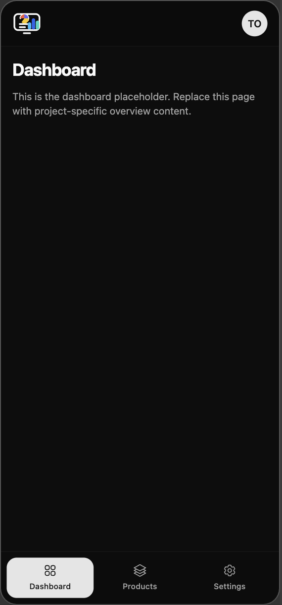

# Dashboard Template

An open source dashboard template built for React projects that need a clean application shell, responsive navigation, protected routes, and realistic starter pages without rebuilding the foundation from scratch.

Built by Youssef Dhibi ([dhibi.tn](https://dhibi.tn)).

Live preview: [dashboard-template-react-vite.youssef.tn](https://dashboard-template-react-vite.youssef.tn)

## Preview

Desktop


Mobile



## Features

- Responsive application shell for desktop and mobile
- Simulated Google sign-in flow for template demos
- Protected routes with session-based redirect behavior
- Dashboard, Products, and Settings starter pages
- Feature-based folder structure
- Reusable shadcn/ui components
- TanStack Query provider setup for future data features

## Tech Stack

- React
- TypeScript
- Vite
- Bun
- Tailwind CSS v4
- shadcn/ui
- React Router
- TanStack Query

## Included Pages

| Route | Description |
| --- | --- |
| `/login` | Simulated sign-in screen |
| `/` | Dashboard starter page |
| `/products` | Products starter page |
| `/settings` | Settings starter page |

## Authentication

This template ships with a simulated Google sign-in flow so the authentication experience works out of the box during development.

- Signing in creates a local session in `localStorage`
- Protected routes redirect unauthenticated users to `/login`
- Signing out clears the session and returns to the login page

The current setup is useful for demos, starter projects, and UI work before wiring a real backend.

## Project Structure

```text
src/
├── app/
│   ├── providers.tsx
│   └── router.tsx
├── components/
│   ├── common/
│   ├── forms/
│   └── ui/
├── features/
│   ├── auth/
│   ├── dashboard/
│   ├── products/
│   └── settings/
├── layouts/
│   ├── app-layout.tsx
│   ├── app-layout-skeleton.tsx
│   └── auth-layout.tsx
├── lib/
│   ├── env.ts
│   ├── react-query.ts
│   └── utils.ts
├── pages/
│   ├── auth/
│   ├── dashboard/
│   ├── products/
│   └── settings/
├── services/
│   └── api-client.ts
└── styles/
    └── globals.css
```

## Getting Started

1. Install dependencies.

```bash
bun install
```

2. Start the development server.

```bash
bun run dev
```

3. Run checks.

```bash
bun run typecheck
bun run lint
bun run build
```

## Environment

| Variable | Required | Description |
| --- | --- | --- |
| `VITE_API_BASE_URL` | No | Base URL for future API integration. Defaults to `http://localhost:3000/api`. |

## Customization Notes

- Replace the starter page content with project-specific features
- Swap the simulated auth flow for a real backend integration when needed
- Extend each feature folder with hooks, services, and types as the project grows

## License

Licensed under the MIT License. See [LICENSE](/Users/youssefsz/WebSites/dashboard-template-react-vite/LICENSE).
