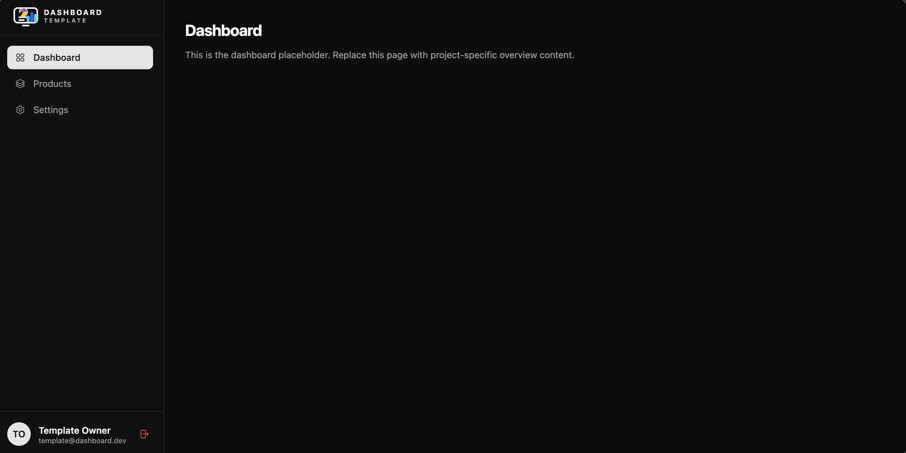

# Dashboard Template

This repository is a reusable dashboard template built with React, TypeScript, and Vite. It keeps the app shell, login experience, protected routes, and responsive navigation, while replacing product-specific screens with neutral placeholders.

Built by Youssef Dhibi ([dhibi.tn](https://dhibi.tn)).



Live preview: [dashboard-template-react-vite.vercel.app](https://dashboard-template-react-vite.vercel.app/)

## What Stays

- Responsive dashboard shell
- Login page and auth guard flow
- Simulated Google sign-in and sign-out
- Feature-based folder structure
- Shared UI primitives and form components
- React Router app structure
- TanStack Query provider setup

## Template Routes

| Route | Purpose |
| --- | --- |
| `/login` | Simulated Google login |
| `/` | Dashboard placeholder |
| `/products` | Products placeholder |
| `/settings` | Settings placeholder |

## Authentication Behavior

The current template uses a simulated Google sign-in flow:

- The login screen keeps the Google-style entry point.
- Clicking the button creates a local session in `localStorage`.
- Protected routes still redirect unauthenticated users to `/login`.
- Signing out clears the local session and returns to the login page.

The previous real Google button/backend flow is intentionally kept as commented code in the auth feature so it can be restored later.

## Project Structure

```text
src/
├── app/
│   ├── providers.tsx
│   └── router.tsx
├── components/
│   ├── common/
│   ├── forms/
│   └── ui/
├── features/
│   ├── auth/
│   ├── dashboard/
│   ├── products/
│   └── settings/
├── layouts/
│   ├── app-layout.tsx
│   ├── app-layout-skeleton.tsx
│   └── auth-layout.tsx
├── lib/
│   ├── env.ts
│   ├── react-query.ts
│   └── utils.ts
├── pages/
│   ├── auth/
│   ├── dashboard/
│   ├── products/
│   └── settings/
├── services/
│   └── api-client.ts
└── styles/
    └── globals.css
```

## Development

1. Install dependencies.

   ```bash
   bun install
   ```

2. Start the dev server.

   ```bash
   bun run dev
   ```

3. Open the URL printed by Vite.

## Environment

| Variable | Required | Description |
| --- | --- | --- |
| `VITE_API_BASE_URL` | No | Base URL for future API integration. Defaults to `http://localhost:3000/api`. |

## Next Template Customizations

- Replace the placeholder pages with real feature content.
- Swap the simulated auth flow back to a real Google/backend integration when needed.
- Add TanStack Query hooks per feature as data fetching is introduced.

## License

This project is licensed under the MIT License. See [LICENSE](/Users/youssefsz/WebSites/dashboard-template-react-vite/LICENSE).
